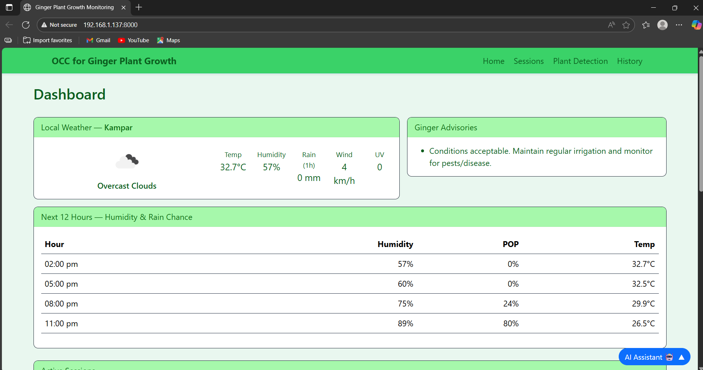

# OCC Ginger - Plant Growth Monitoring System

An AI-powered system for monitoring ginger plant growth using computer vision and machine learning. This system provides automated detection, analysis, and reporting capabilities for ginger plant cultivation across different growth phases.


## 🌱 Features

- **Multi-Phase Plant Detection**: Supports 4 growth phases (Early Sprouting, Vegetative Growth, Bulking Phase, Rhizome Maturation)
- **AI-Powered Analysis**: Uses YOLO object detection and MAML (Model-Agnostic Meta-Learning) for plant classification
- **Real-time Weather Integration**: Weather data integration for environmental context
- **Interactive Web Interface**: Modern, responsive web dashboard for monitoring and analysis
- **Automated Report Generation**: PDF reports with AI-generated insights and recommendations
- **Session Management**: Track multiple growing sessions with week-by-week progress
- **Bulk Image Processing**: Upload and process multiple images simultaneously
- **AI Chat Assistant**: Integrated chatbot for agronomic advice and plant care guidance

## 🏗️ Project Structure

```
OCC_Ginger/
├── backend/                 # Backend API and AI services
│   ├── ai_service.py       # Main Flask API server
│   ├── database.py         # Database models and schema
│   ├── inference_engine.py # AI model inference engine
│   ├── gemini_client.py    # AI reasoning integration
│   ├── report_gen.py       # PDF report generation
│   ├── model_paths.py      # Model configuration
│   ├── week_utils.py       # Growth phase utilities
│   ├── models/             # Pre-trained AI models
│   ├── uploads/            # Original uploaded images
│   ├── results/            # Annotated detection results
│   └── artifacts/          # Generated reports and artifacts
│   └──.env                 # Store Credentials and Path Details
├── web/                    # Frontend web application
│   ├── web_app.py         # Flask web server
│   ├── templates/         # HTML templates
│   └── static/            # CSS and JavaScript assets
└── test_setup/            # Sample test images
```

## 🚀 Installation

### Prerequisites

- Python 3.8 or higher
- CUDA-compatible GPU (recommended for faster inference)
- At least 4GB RAM
- 2GB free disk space

### Step 1: Clone the Repository

```bash
git clone https://github.com/ErnestTCY/FYP-One_Class_Classification_for_Ginger_Plant_Growth_Monitoring.git
```

### Step 2: Create Virtual Environment

```bash
# Create virtual environment
python -m venv venv

# Activate virtual environment
# On Windows:
venv\Scripts\activate
# On macOS/Linux:
source venv/bin/activate
```

### Step 3: Install Dependencies

```bash
# Install backend dependencies
cd backend
pip install -r requirements.txt

# Install additional dependencies for web interface
cd ../web
pip install Flask requests python-dotenv
```

### Step 4: Environment Configuration

Create a `.env` file in the `backend/` directory:

```env (Create a .env file inside the /backend directory)
# Database Configuration
DATABASE_URL=sqlite:///ginger_occ.db
SECRET_KEY=your-secret-key-here

# AI Model Configuration
YOLO_WEIGHTS=models/yolo_ginger_bag.pt
CONF_THRESH=0.5
AREA_THRESH=500
TAU_OVERRIDE=0.6
TAU_SCALE=0.9
BOX_WIDTH=6

# Optional: AI Reasoning (Gemini API)
GEMINI_API_KEY=your-gemini-api-key

# Optional: Weather Integration
WEATHER_API_KEY=your-openweather-api-key
WEATHER_LAT=your-latitude
WEATHER_LON=your-longitude
WEATHER_UNITS=metric

# File Storage
UPLOAD_DIR=./uploads
RESULTS_DIR=./results
ARTIFACTS_DIR=./artifacts
```

## 🏃‍♂️ Running the Application

### Method 1: Using Two Terminal Windows

**Terminal 1 - Backend API Server:**
```bash
cd backend
python ai_service.py
```
The backend API will run on `http://127.0.0.1:8001`

**Terminal 2 - Web Interface:**
```bash
cd web
python web_app.py
```
The web interface will run on `http://127.0.0.1:8000`

### Method 2: Using Background Processes

**Windows:**
```bash
# Start backend in background
start /B python backend/ai_service.py

# Start web interface
python web/web_app.py
```

**macOS/Linux:**
```bash
# Start backend in background
python backend/ai_service.py &

# Start web interface
python web/web_app.py
```

### Method 3: Using a Process Manager (Advanced)
```bash
python run.py
```
## 📱 Usage

1. **Access the Web Interface**: Open `http://127.0.0.1:8000` in your browser
2. **Create a Session**: Start a new growing session with your ginger plants
3. **Upload Images**: Upload images of your ginger plants for analysis
4. **View Results**: Check detection results, growth analysis, and AI recommendations
5. **Generate Reports**: Create PDF reports with detailed insights
6. **Monitor Progress**: Track plant health across different growth phases

### Key Features:

- **Dashboard**: Overview of all sessions and recent detections
- **Plant Detection**: Upload images for AI-powered analysis
- **Session Management**: Create and manage multiple growing sessions
- **Weekly Analysis**: View progress by week with detailed breakdowns
- **AI Chat**: Get personalized advice for your ginger plants
- **Report Generation**: Export detailed PDF reports

## 🤖 AI Models

The system uses several pre-trained models:

- **YOLO Model**: `yolo_ginger_bag.pt` - Object detection for ginger plants and bags
- **MAML Models**: 
  - `VG_maml_4shots.pth` - Vegetative Growth phase classification
  - `BP_maml_5shots.pth` - Bulking Phase classification  
  - `RM_maml_3shots.pth` - Rhizome Maturation classification

## 🔧 Configuration

### Growth Phases

The system automatically determines plant growth phase based on week number:

- **Weeks 1-4**: Early Sprouting
- **Weeks 5-9**: Vegetative Growth  
- **Weeks 10-14**: Bulking Phase
- **Weeks 15-20**: Rhizome Maturation

### Detection Classes

- **Normal Plant**: Healthy ginger plants
- **Abnormal Plant**: Plants showing signs of disease or stress
- **Empty Bag Detected**: Empty growing bags

## 📊 API Endpoints

### Main Endpoints:

- `GET /api/sessions` - List all sessions
- `POST /api/sessions` - Create new session
- `GET /api/detections` - List detections
- `POST /api/jobs` - Submit image for analysis
- `GET /api/weather` - Get weather data
- `POST /api/chat` - AI chat interface

### Session Management:

- `GET /api/sessions/{id}` - Get session details
- `PATCH /api/sessions/{id}` - Update session
- `DELETE /api/sessions/{id}` - Delete session

## 🛠️ Development

### Adding New Features

1. **Backend**: Modify `backend/ai_service.py` for new API endpoints
2. **Frontend**: Update templates in `web/templates/` and static files in `web/static/`
3. **Database**: Modify `backend/database.py` for schema changes

### Testing

Use the sample images in `test_setup/` directory to test the system:

```bash
# Test different growth phases
test_setup/1es/  # Early Sprouting samples
test_setup/2vg/  # Vegetative Growth samples  
test_setup/3bp/  # Bulking Phase samples
test_setup/4rm/  # Rhizome Maturation samples
```

## 🐛 Troubleshooting

### Common Issues:

1. **Port Already in Use**: Change ports in the respective Python files
2. **Model Loading Errors**: Ensure model files are in the `backend/models/` directory
3. **Database Errors**: Delete `backend/instance/ginger_occ.db` to reset database
4. **Memory Issues**: Reduce batch size or use CPU-only mode

### Performance Optimization:

- Use GPU acceleration for faster inference
- Adjust `CONF_THRESH` for different detection sensitivity
- Monitor disk space for uploaded images and results

## 📄 License
This project is licensed under the [MIT License](LICENSE).

## 🤝 Contributing

1. Fork the repository
2. Create a feature branch (`git checkout -b feature/amazing-feature`)
3. Commit your changes (`git commit -m 'Add some amazing feature'`)
4. Push to the branch (`git push origin feature/amazing-feature`)
5. Open a Pull Request

---

**Happy Growing! 🌱**
