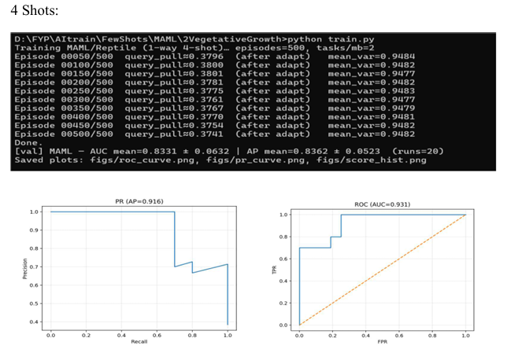
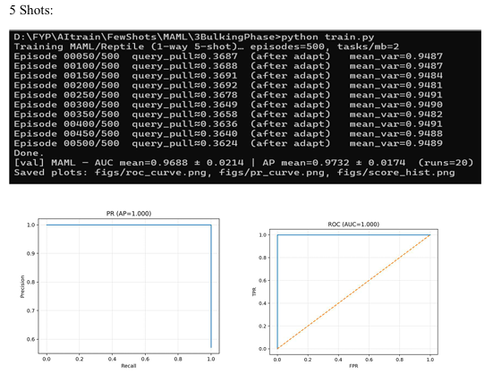
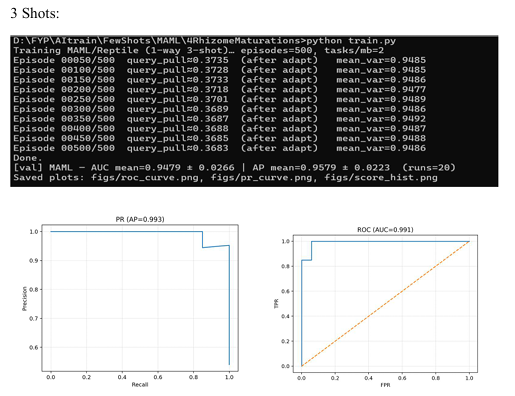
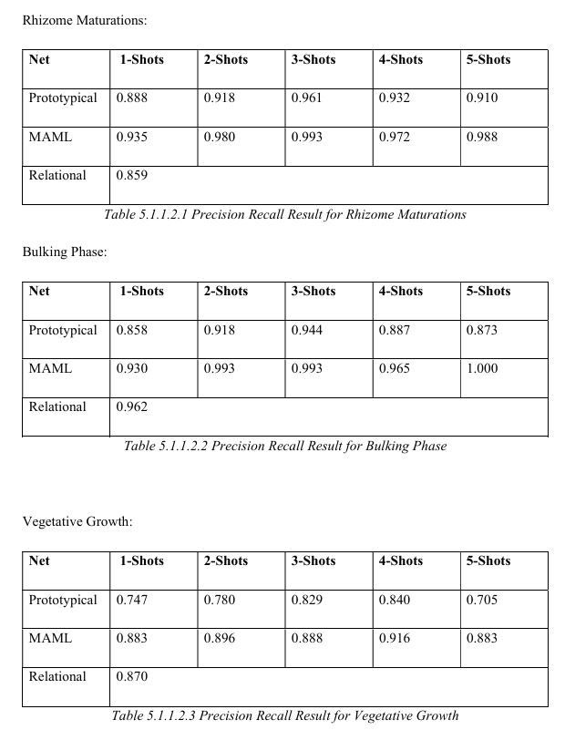

# One-Class-Classifier Training for Ginger Growth Phase Classification


## Getting Started

### Clone the Repository

```bash
git clone https://github.com/ErnestTCY/FYP-One_Class_Classification_for_Ginger_Plant_Growth_Monitoring.git
```

### Install Dependencies

```bash
pip install -r requirements.txt
```

### Verify Installation

```bash
python -c "import torch, torchvision, sklearn, matplotlib, numpy, PIL; print('All dependencies installed successfully!')"
```

### Quick Start

Once you have the repository cloned and dependencies installed, you can start training immediately:

```bash
# Train MAML on Vegetative Growth phase
python MAML/MAML_Training.py --train_dir Datasets/2VegetativeGrowth/train/Normal --val_normal Datasets/2VegetativeGrowth/val/Normal --val_anom Datasets/2VegetativeGrowth/val/Abnormal --k_shot 5 --episodes 100 --checkpoint MAML/checkpoints/VG_test.pth

# Train Prototypical Network on Bulking Phase
python Prototypical/PrototypicalNet_Training.py --train_dir Datasets/3BulkingPhase/train/Normal --val_normal Datasets/3BulkingPhase/val/Normal --val_anom Datasets/3BulkingPhase/val/Abnormal --k_shot 5 --episodes 100 --checkpoint Prototypical/checkpoints/BP_test.pth

# Train Relational Network on Rhizome Maturation
python RelationalNet/Relational_Train.py --train_dir Datasets/4RhizomeMaturations/train/Normal --val_normal Datasets/4RhizomeMaturations/val/Normal --val_anom Datasets/4RhizomeMaturations/val/Abnormal --episodes 100 --checkpoint RelationalNet/checkpoints/RM_test.pth
```

## Overview

The project implements three different meta-learning architectures:

1. **MAML (Model-Agnostic Meta-Learning)** - Reptile-style meta-training for few-shot adaptation
2. **Prototypical Networks** - Distance-based classification using prototype representations
3. **Relational Networks** - Relation learning for similarity-based anomaly detection

## Dataset Structure

The dataset is organized into three main growth phases:

### 1. Vegetative Growth Phase (VG)
- **Location**: `Datasets/2VegetativeGrowth/`
- **Training**: 5 normal images
- **Validation**: 20 normal images + 10 abnormal images
- **Characteristics**: Early stage ginger growth focusing on leaf development

### 2. Bulking Phase (BP)  
- **Location**: `Datasets/3BulkingPhase/`
- **Training**: 4 normal images + 158 DS (disease) images
- **Validation**: 20 normal images + 20 abnormal images
- **Characteristics**: Active growth phase where ginger rhizomes expand

### 3. Rhizome Maturation Phase (RM)
- **Location**: `Datasets/4RhizomeMaturations/`
- **Training**: 5 normal images (4 JPG + 1 PNG)
- **Validation**: 20 normal images + 20 abnormal images  
- **Characteristics**: Final maturation stage of ginger rhizomes

## Training Process

### MAML Training (`MAML/MAML_Training.py`)

The MAML implementation uses a Reptile-style meta-learning approach:

```bash
python MAML/MAML_Training.py \
    --train_dir Datasets/2VegetativeGrowth/train/Normal \
    --val_normal Datasets/2VegetativeGrowth/val/Normal \
    --val_anom Datasets/2VegetativeGrowth/val/Abnormal \
    --k_shot 5 \
    --episodes 500 \
    --checkpoint MAML/checkpoints/VG_maml_5shots.pth
```

**Key Features:**
- **Inner Loop**: Adapts head weights using K-shot support set
- **Outer Loop**: Meta-updates using Reptile algorithm
- **Architecture**: Frozen ResNet18 backbone + trainable head
- **Loss**: Prototype-based center loss + variance regularization

### Prototypical Network Training (`Prototypical/PrototypicalNet_Training.py`)

Prototypical networks learn to create prototype representations:

```bash
python Prototypical/PrototypicalNet_Training.py \
    --train_dir Datasets/3BulkingPhase/train/Normal \
    --val_normal Datasets/3BulkingPhase/val/Normal \
    --val_anom Datasets/3BulkingPhase/val/Abnormal \
    --k_shot 5 \
    --episodes 500 \
    --checkpoint Prototypical/checkpoints/BP_5shot.pth
```

**Key Features:**
- **Prototype Creation**: Mean of normalized embeddings from support set
- **Distance Metric**: Euclidean distance for anomaly scoring
- **Regularization**: Variance regularizer to prevent embedding collapse
- **Robust Prototype**: Optional trimming of outlier support samples

### Relational Network Training (`RelationalNet/Relational_Train.py`)

Relational networks learn pairwise similarity relationships:

```bash
python RelationalNet/Relational_Train.py \
    --train_dir Datasets/4RhizomeMaturations/train/Normal \
    --val_normal Datasets/4RhizomeMaturations/val/Normal \
    --val_anom Datasets/4RhizomeMaturations/val/Abnormal \
    --episodes 800 \
    --batch_images 32 \
    --checkpoint RelationalNet/checkpoints/RM_relational.pth
```

**Key Features:**
- **Pair Generation**: Positive pairs (same image) + negative pairs (different images)
- **Relation Head**: MLP processing concatenated embeddings
- **Similarity Learning**: Binary classification of image pairs
- **Anomaly Scoring**: 1 - max(similarity with support set)

## Results and Visualizations

The training results are visualized in the `/Images` directory:

### Selected Models Accuracy

The following images show the accuracy results for the selected models across different growth phases:

#### Vegetative Growth Phase (VG)

*4-shot examples from Vegetative Growth phase showing selected model accuracy*

#### Bulking Phase (BP)

*5-shot examples from Bulking Phase showing selected model accuracy*

#### Rhizome Maturation Phase (RM)

*3-shot examples from Rhizome Maturation phase showing selected model accuracy*

### Performance Metrics for All Models

The following visualizations show the overall performance metrics across all models:

#### ROC (AUC) Curves
.png)
*Receiver Operating Characteristic curves showing Area Under Curve for all models*

#### Precision-Recall Curves

*Precision-Recall curves for anomaly detection performance across all models*

## Model Architecture

All three approaches share a common backbone architecture:

```
ResNet18 (ImageNet pretrained, frozen)
    ↓
Linear Layer (512 → 128)
    ↓
L2 Normalization
    ↓
[Method-specific head]
```

### Method-Specific Components:

1. **MAML**: Adaptive head weights updated via inner loop
2. **Prototypical**: Prototype computation from support embeddings
3. **Relational**: Relation head MLP for pairwise similarity

## Training Configuration

### Data Augmentation
- **Training**: Random crop, flip, rotation, color jitter, Gaussian blur, random erasing
- **Evaluation**: Center crop only

### Hyperparameters
- **Embedding Dimension**: 128
- **Learning Rate**: 1e-3 (outer loop for MAML, standard for others)
- **Inner Learning Rate**: 5e-3 (MAML inner loop)
- **Episodes**: 500-800 depending on method
- **K-shot**: 1-5 shots for few-shot evaluation

## Evaluation Protocol

All methods use the same evaluation protocol:

1. **Support Set**: Randomly sample K normal images
2. **Query Set**: Remaining normal images + all abnormal images  
3. **Scoring**: Compute anomaly scores for each query
4. **Metrics**: AUC (Area Under ROC Curve) and AP (Average Precision)
5. **Multiple Runs**: Average over multiple random support set selections

## File Structure

```
Classifier_Net
├── checkpoints 
│   ├── prototypical_1shots.pth 
│   ├── prototypical_2shots.pth 
│   ├── prototypical_3shots.pth 
│   ├── prototypical_4shots.pth 
│   └── prototypical_5shots.pth 
├── dataset 
│   ├── train
│   │   └── Normal 
│   │       ├── 5 Normal Plant Images for Different Shots
│   └── val 
│       ├── Abnormal 
│       │   ├── 20 Abnormal Plant Images
│       └── Normal
│           ├── 20 Normal Plant Images
├── figs 
│   ├── 1Shots
│   ├── 2Shots
│   ├── 3Shots
│   ├── 4Shots
│   └── 5Shots
└── train.py
```

## Usage

### Training a New Model

1. **Prepare Dataset**: Organize images into train/val splits with Normal/Abnormal folders
2. **Update Paths**: Modify default paths in the training scripts
3. **Run Training**: Execute the appropriate training script with desired parameters
4. **Monitor Progress**: Training logs show loss, accuracy, and embedding statistics

### Evaluating Trained Models

Each training script automatically runs evaluation after training, generating:
- ROC and PR curves
- Score distribution histograms  
- Performance metrics (AUC, AP)

### Checkpoint Files

Trained models are saved as PyTorch checkpoints containing:
- Model state dictionary
- Configuration parameters
- Embedding dimensions
- Training metadata

## Dependencies

All required dependencies are listed in `requirements.txt`:

- Python 3.7+
- PyTorch 1.9+
- torchvision 0.10+
- scikit-learn 1.0+
- matplotlib 3.3+
- numpy 1.21+
- Pillow 8.3+

To install all dependencies at once:
```bash
pip install -r requirements.txt
```

## Key Insights

1. **MAML** excels at rapid adaptation with minimal support samples
2. **Prototypical Networks** provide robust baseline performance with simple distance metrics
3. **Relational Networks** learn complex similarity patterns but require more training data
4. **Few-shot Performance**: All methods show competitive results with 3-5 support samples
5. **Phase-specific**: Different growth phases show varying difficulty levels for anomaly detection

This implementation provides a comprehensive framework for few-shot anomaly detection in agricultural computer vision applications, specifically tailored for ginger growth phase monitoring.
